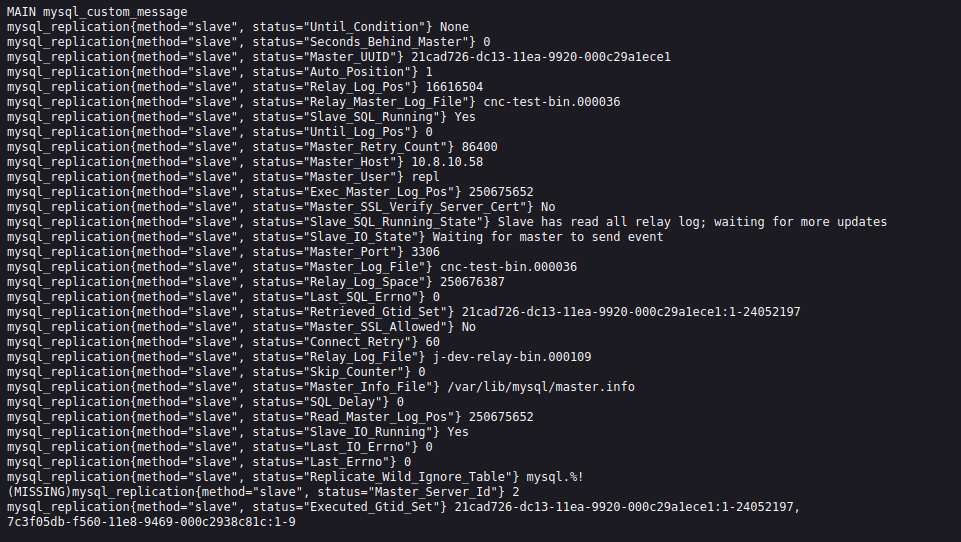

# MySQL Slave replication status exporter
Golang MySQL Slave replication status exporter for prometheus. Gives database replication metrics to the scraper.

## TODO
* HTTP сервер хостящий страничку с метриками;
* страница с метриками репликации;
* email уведомления на ошибки репликации базы данных MySQL;
* prometheus мониторинг репликации (ссылка на дашборд Grafana с текущим статусом).

## Актуальность
  Проблема, с которой пришлось столкнуться перед принятием решения писать свой exporter: [mysqld_exporter](https://github.com/prometheus/mysqld_exporter), к большому удивлению, не собирает метрик по состоянию репликации

## Stack

    
    
    
    
    
    

**Настройки IPTABLES можно посмотреть в [man](https://github.com/Samson-P/MySQL-replication-Slave-status-exporter/blob/main/man)**
